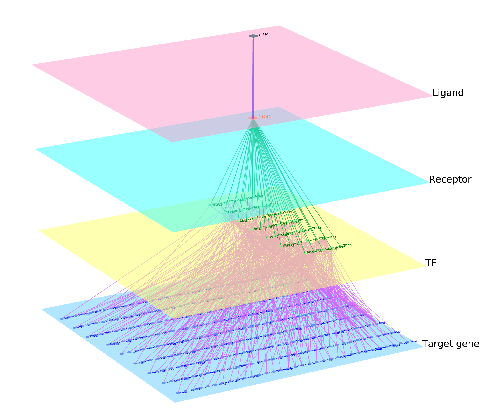
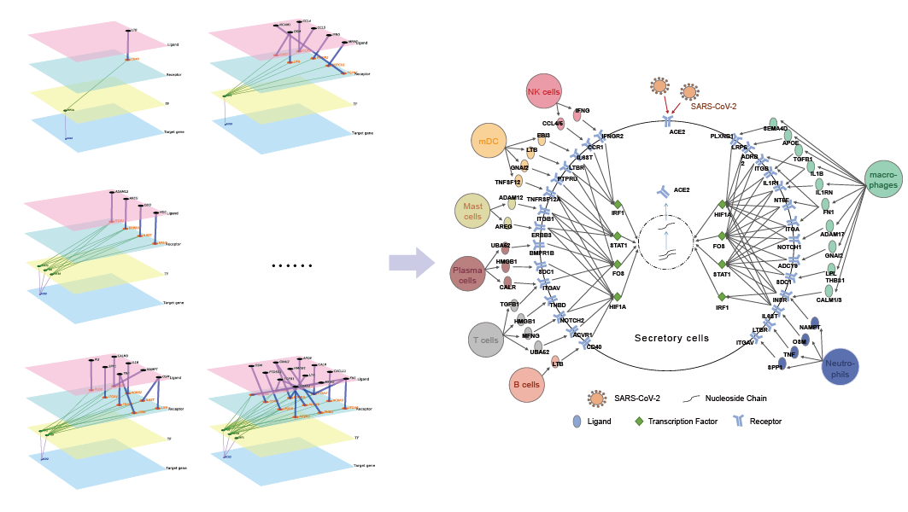

```{r, include = FALSE}
knitr::opts_chunk$set(
  collapse = TRUE,
  comment = "#>"
)
```

For this tutorial, we will be using scMLnet to construct the multi-layer signaling network between B cells and Secretory cells from scRNA-Seq data of BALF in COVID-19 patients. The expression matrix and annotation of clstuers can be found in the `/example` folder (or be downloaded from <a href="https://zenodo.org/record/4267609#.X6uRrVC-vVg" target="_blank">Zenodo</a>) and the prior information about interactions in the `/database` folder.

# Preparation

## Required packages

We start by loading all required packages. The `Seurat` package is used for normalizing the raw scRNA-Seq data, the `Matrix` package is used for transformation between matrix and sparse matrix and the `parallel` package is used for parallel computation of t.test for screening potentially highly expressed genes.

```{r eval=FALSE}
library(Seurat)
library(Matrix)
library(parallel)
library(scMLnet)
```

## Input data

We then read a raw scRNA-Seq data with rows as genes (gene symbols) and columns as cells and the gene expression matrix is required as a sparse matrix. Annotation of cell type consists of two columns: the first column is barcode and the second is cell type. The column number of the gene expression matrix should consistent with the row number of the annotation table. Numbers can also be used to replace specific cell types in BarCluFile, but the biological explanation of cell-cell communication between groups is not clear enough.

```{r eval=FALSE}
# import sample data
GCMat <- readRDS("./example/data.Rdata")
GCMat<- as(GCMat,"dgCMatrix")

# import sample annotation
BarCluFile <- "./example/barcodetype.txt"
BarCluTable <- read.table(BarCluFile,sep = "\t",header = TRUE,stringsAsFactors = FALSE)
```

We next define the receiver cell and sender cell that we want to explorer the cell-cell communication between them. In this time, we focus on the inter-/intracellular signaling network between B cells as sender cell and Secretory cells as receiver cell (**NOTE**: make sure the `LigClu` and `RecClu` parameters are the values in the annotation table).

```{r eval=FALSE}
types <- unique(BarCluTable$Cluster)

LigClu <- "B cells"       #types[4]
RecClu <- "Secretory"     #types[8]
```

## Default parameters

Default parameter settings are as follows. Users can provide their own databases which must including three colums: molecule A, molecule B and key (connecting A with B by underlined). Molecules A and B need to have clear identities (i.e., Ligand, Receptor, TF and Target gene), and there are interactions between them (i.e., Ligand_Receptor, Receptor_TF and TF_Gene interactions).

According to the difference (subjected to `pct` parameter) and ratio (subjected to `logfc` parameter) of gene expression percentage between the sender cells and receiver cells, we firstly define specific highly expressed genes in each of the two types of cells. The highly expressed genes in sender cells are considered as potential ligands and the highly expressed genes in receiver cells are considered as potential receptors and target genes. We screen the potential Ligand-Receptor interactions by searching the Ligands-Receptor pairs in database.

We then screen the potential Receptor-TF, TF-Target gene interactions by Fisher's Exact Test (subjected to `pval` parameter). The potential TF-Target gene interactions can be inferred from the potential target genes and the potential Receptor-TF interactions can be inferred from the potential activated TF from the potential TF-Target gene interactions.

```{r eval=FALSE}
pval <- 0.05
logfc <- 0.15
cores <- NULL
LigRecLib <- "./database/LigRec.txt"
TFTarLib <- "./database/TFTargetGene.txt"
RecTFLib <- "./database/RecTF.txt"
```

# Construction of Multi-layer Signaling Networks

Running time of getting highly expressed genes depends on the t-test of gene expression in two types of cells. Setting the `cores` parameter can improve the performance of scMLnet (**Precondition**: the parallel package has been installed and the number of cores available is set up correctly).

```{r eval=FALSE}
cores <- detectCores()-1
netList <- RunMLnet(GCMat, BarCluFile, RecClu, LigClu, 
                    pval, logfc, cores, 
                    LigRecLib, TFTarLib, RecTFLib)
```

# Save and Visualization of Multi-layer Signaling Networks

The output `netList` is a list consisted of gene pairs connecting each upstream layer and downstream layer (i.e., Ligand_Receptor, Receptor_TF and TF_Gene subnetworks). The signaling subnetwork is returned as a dataframe object as the same structure as sample databases. 

```{r eval=FALSE}
workdir <- "sample"
DrawMLnet(netList,LigClu,RecClu,workdir,plotMLnet = F)
```

If you want to visualize the tabular results of multi-layer signaling network, make sure the correct installation of following three python packages: networkx, matplotlib and pymnet and the correct setting of PyHome parameter in `DrawMLnet` funtion. The tabular and graphic output of the constructed multi-layer network will be saved in the `/output/sample/B_Hepatocytes` folder.

```{r eval=FALSE}
workdir <- "sample"
PyHome <- "D:/Miniconda3/envs/R36/python.exe" #for Window
DrawMLnet(netList,LigClu,RecClu,workdir,PyHome,plotMLnet = T)
```

<div align=center>

</div>

---

# Construction of Multi-cellular Multi-layer Signaling Networks

In scMLnet, we only focus one pairs of cell type every time, however we can always remain the same receiver cells and only change sender cells so as to construct the microenvironment of receiver cells (the central cells) affected by sender cells (neighbor cells). 

```{r eval=FALSE}

# import data
GCMat <- readRDS("./example/data.Rdata")
GCMat<- as(GCMat,"dgCMatrix")

# import annotation
BarCluFile <- "./example/barcodetype.txt"
BarCluTable <- read.table(BarCluFile,sep = "\t",header = TRUE,stringsAsFactors = FALSE)

## get LigClu
LigClus <- unique(BarCluTable$Cluster)
LigClus <- LigClus[-grep("Secretory|Doublets",LigClus)]

## get cores
cores <- detectCores()-1

## creat MLnet
netList <- list()
for(ligclu in LigClus){
  
  #sender cell and receiver cell
  LigClu <- ligclu
  RecClu <- "Secretory"
  
  name <- paste(strsplit(LigClu,split = "\\W")[[1]][1],RecClu,sep = "_")
  
  #main
  netList[[name]] <- RunMLnet(GCMat,BarCluFile,RecClu,LigClu,cores = cores)
  
}

## save output and plot MLnet
workdir <- "microenvironment"
for (name in names(netList)) {
  
  #scMLnet output
  MLnetList <- netList[[name]]
  print(paste0(name,":"))
  
  #sender cell and receiver cell
  LigClu <- strsplit(name,"_")[[1]][1]
  RecClu <- strsplit(name,"_")[[1]][2]
  
  #main
  PyHome <- "D:/Miniconda3/envs/R36/python.exe" #for Window
  DrawMLnet(MLnetList,LigClu,RecClu,workdir,PyHome,plotMLnet = T)
  
}

```

The demo of multi-cellular-mediated ACE2 regulation based on the scRNA-seq data of bronchoalveolar lavage fluid (BALF) in COVID-19 patients:

<div align=center>

</div>